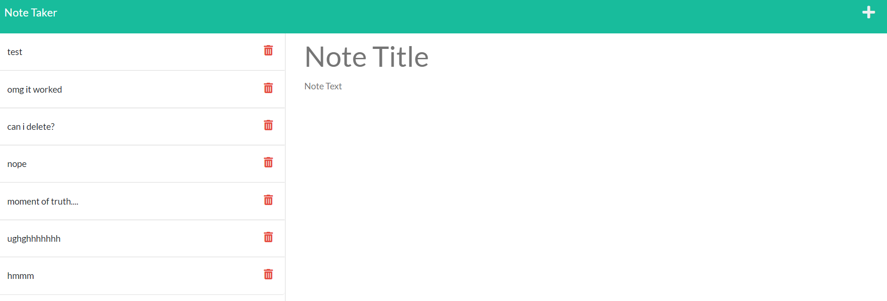

  
  # Note Taker

  
  ## Description
  This project uses HTML, CSS, Node.js, and Express.js to create a notetaking application that helps you to keep track of tasks that need to be completed.
  
  ## Table of Contents
- [Note Taker](#note-taker)
  - [Description](#description)
  - [Table of Contents](#table-of-contents)
  - [Installation Instructions](#installation-instructions)
  - [Usage Information](#usage-information)
    - [Contribution Guidelines](#contribution-guidelines)
  - [Tests](#tests)
  - [Licensing](#licensing)
  - [Questions](#questions)
  
  
  